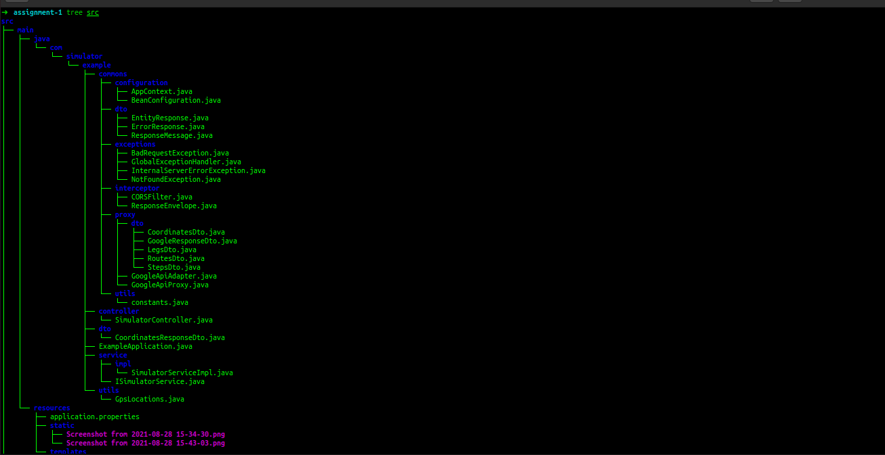

# Locus Map Simulator Assignment

# Tools/Framework:
- Springboot 
- OpenFeign [For Service call]
- Lombok [Auto Generate Getter/Setters and other codes]
- ModelMapper [E2Dto/Dto2E]

# Folder structuring

1. **controller**
2. **dto**
3. **service**
   1. impl
4. **utils**
5. **commons**
   1. configuration
   2. dto
   3. exception[global-exception-handler]
   4. interceptor
   5. proxy[service-calls]
   6. utils[common]

-----------------------------------------------------------

